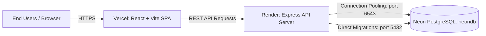

# Production Deployment Guide: Render, Neon & Vercel

This guide outlines the end-to-end instructions for deploying **IndusConnect** to production:
- **Database**: [Neon](https://neon.tech) (Serverless PostgreSQL)
- **Backend API**: [Render](https://render.com) (Node.js & Express)
- **Frontend App**: [Vercel](https://vercel.com) (React + Vite SPA)

---

## Architecture Overview



---

## 1. Database Setup: Neon PostgreSQL

1. Log into your [Neon Console](https://console.neon.tech).
2. Click **Create Project**:
   - **Project Name**: `indusconnect` (or your choice)
   - **Postgres Version**: `16` (or latest)
   - **Region**: Choose a region closest to your Render server (e.g., `AWS US East (Ohio / N. Virginia)` or `EU Central`).
3. On the **Project Dashboard**, navigate to **Connection Details**:
   - **Pooled connection (Checked)**: Copy the connection string. This is your `DATABASE_URL`.
     ```text
     postgresql://[user]:[password]@[ep-xxx-pooler].[region].aws.neon.tech/neondb?sslmode=require
     ```
   - **Pooled connection (Unchecked)**: Copy the connection string. This is your `DIRECT_URL`.
     ```text
     postgresql://[user]:[password]@[ep-xxx].[region].aws.neon.tech/neondb?sslmode=require
     ```
   > [!IMPORTANT]
   > Prisma requires `DATABASE_URL` (with `-pooler`) for low-latency pooled queries and `DIRECT_URL` (without `-pooler`) for Prisma migration locking.

---

## 2. Backend Deployment: Render (Onrender)

### Option A: Automatic Deployment using Render Blueprint (`render.yaml`)
1. Go to [Render Dashboard](https://dashboard.render.com).
2. Click **New +** -> **Blueprint**.
3. Connect your GitHub repository: `indusconnect`.
4. Render will automatically detect [`render.yaml`](file:///c:/Users/affan/OneDrive/Documents/GitHub/indusconnect/render.yaml).
5. Enter the values for the environment variables when prompted:
   - `DATABASE_URL`: Your Neon pooled connection string
   - `DIRECT_URL`: Your Neon direct connection string
   - `CLIENT_URL`: `https://your-app-name.vercel.app` (or temporary `*` until Vercel generates the domain)
6. Click **Apply**. Render will build and deploy the backend.

---

### Option B: Manual Web Service Setup on Render
1. Click **New +** -> **Web Service**.
2. Connect your GitHub repository.
3. Configure the following service settings:
   - **Name**: `indusconnect-backend`
   - **Region**: Same as or close to your Neon database region
   - **Branch**: `main`
   - **Root Directory**: `server`
   - **Runtime**: `Node`
   - **Build Command**:
     ```bash
     npm install && npm run build && npx prisma migrate deploy
     ```
   - **Start Command**:
     ```bash
     npm start
     ```
   - **Plan Type**: `Free` or higher

4. Under **Advanced**:
   - **Health Check Path**: `/health`

5. Add **Environment Variables**:

| Variable | Value | Description |
| :--- | :--- | :--- |
| `NODE_ENV` | `production` | Production environment flag |
| `DATABASE_URL` | `postgresql://...-pooler...` | Neon pooled connection string |
| `DIRECT_URL` | `postgresql://...` | Neon direct connection string |
| `JWT_SECRET` | *32+ character random string* | Used to sign and verify authentication tokens |
| `CLIENT_URL` | `https://your-frontend.vercel.app` | Vercel production URL for CORS |

6. Click **Create Web Service**.

### Seed the Initial Admin & Demo Users
Once the backend is deployed and migrations have completed:
1. Open the Render Web Service dashboard.
2. Click on the **Shell** tab on the left menu.
3. Run:
   ```bash
   npm run db:seed
   ```
4. This creates all initial roles and demo users:
   - **Admin**: `admin@indusconnect.com` / `Admin@123`
   - **Employee**: `employee@indusconnect.com` / `Demo@123`
   - **Manager**: `manager@indusconnect.com` / `Demo@123`
   - **Transport Admin**: `transport@indusconnect.com` / `Demo@123`
   - **Accommodation Admin**: `accommodation@indusconnect.com` / `Demo@123`
   - **Finance Officer**: `finance@indusconnect.com` / `Demo@123`
   - **Driver**: `driver@indusconnect.com` / `Demo@123`
   - **Security Officer**: `security@indusconnect.com` / `Demo@123`

---

## 3. Frontend Deployment: Vercel

1. Log into your [Vercel Dashboard](https://vercel.com).
2. Click **Add New...** -> **Project**.
3. Import your GitHub repository: `indusconnect`.
4. Configure the project:
   - **Framework Preset**: `Vite`
   - **Root Directory**: Click **Edit** and choose `client`
   - **Build and Output Settings**: Default (`npm run build` and `dist`)
5. In **Environment Variables**, add:

| Key | Value | Example |
| :--- | :--- | :--- |
| `VITE_API_BASE_URL` | `https://<your-render-service>.onrender.com/api` | `https://indusconnect-backend.onrender.com/api` |

6. Click **Deploy**.
   - Vercel will install dependencies, compile the React application, and configure SPA routing rewrites through [`client/vercel.json`](file:///c:/Users/affan/OneDrive/Documents/GitHub/indusconnect/client/vercel.json).

---

## 4. Final CORS Synchronization

1. Note your Vercel deployment URL (e.g. `https://indusconnect.vercel.app`).
2. Go back to Render Dashboard -> **indusconnect-backend** -> **Environment**.
3. Update `CLIENT_URL` to match your Vercel domain:
   ```text
   CLIENT_URL=https://indusconnect.vercel.app
   ```
4. Render will automatically redeploy with the updated CORS configuration.

---

## 5. Verification & Health Checks

- **Render Liveness Probe**:
  Visit `https://<backend>.onrender.com/health`
  Expected response: `{"status":"ok","uptime":...}`
- **Database Diagnostic**:
  Visit `https://<backend>.onrender.com/api/health`
  Expected response: `{"success":true,"message":"IndusConnect backend is healthy","data":{"database":"connected"...}}`
- **Frontend App**:
  Visit `https://<frontend>.vercel.app/login` and log in with:
  - Email: `admin@indusconnect.com`
  - Password: `Admin@123`
